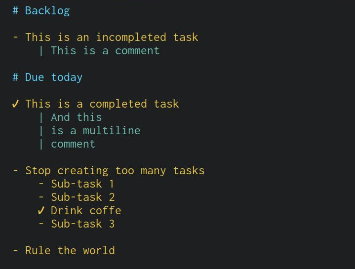

# Todo.vim

Todo.vim is a plugin which provides suppport fort a new filetype : `*.todo` files




It exposes a basic api

* `:ToggleTask` that toggle the state of a task between done and not done

* `:NextUncompletedTask` to jump to the next unlompleted task

* `:PreviousUncompletedTask` to jump to the previous unlompleted task

## Install

You can use your favourite plugin manager to install it.

For example for any Neovim enjoyer you can juste use :

```use('J-Merle/vim-todo')```


